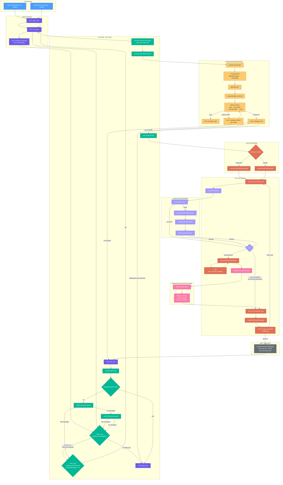

# Agent Loop Architecture

> Source: `packages/agent/src/agent-loop.ts`

## Flowchart

## Key Design Decisions

1. **Two-layer loop**: The outer loop handles follow-up messages (queued while the agent runs),
   the inner loop processes tool calls and steering messages within a single "conversation turn".

2. **AgentMessage abstraction**: All messages flow as `AgentMessage` throughout the loop.
   Conversion to LLM-native `Message[]` happens only in `convertToLlm()` right before
   the provider call, keeping the loop provider-agnostic.

3. **Dual tool execution modes**:
   - **Sequential**: each tool is prepared → executed → finalized one at a time, with events
     emitted in order.
   - **Parallel**: all tools are prepared sequentially, then allowed tools execute concurrently.
     `tool_execution_end` is emitted in completion order; tool-result messages are emitted in
     assistant source order.

4. **Hook pipeline per tool**: `beforeToolCall` → `execute` → `afterToolCall`, with each hook
   able to short-circuit (block) or override results.

5. **Streaming**: Assistant responses stream delta-by-delta via `message_update` events, while
   tool execution streams via `tool_execution_update` events. The partial message is kept
   in-place in `context.messages` and atomically replaced on each delta.

## Entry Points

### `agentLoop(prompts, ctx, config)`

Starts a new agent run with one or more prompt messages. Creates a new `EventStream`, spawns
`runAgentLoop` in the background (fire-and-forget), and returns the stream immediately.

Events emitted upfront: `agent_start` → `turn_start` → `message_start/end` (× prompts).

### `agentLoopContinue(ctx, config)`

Resumes an agent run from existing context without adding new messages. Used for retries.
Validates that the last context message is not `assistant`, then spawns `runAgentLoopContinue`.

## Event Stream Protocol

| Event | When Emitted |
|---|---|
| `agent_start` | Run begins |
| `turn_start` | Each inner-loop iteration starts |
| `message_start` | A message enters the transcript |
| `message_update` | Delta on the in-progress assistant message |
| `message_end` | A message is finalized |
| `tool_execution_start` | Tool execution begins |
| `tool_execution_update` | Partial result from a running tool |
| `tool_execution_end` | Tool execution completes |
| `turn_end` | Inner-loop iteration completes |
| `agent_end` | Run terminates (carries final `messages[]`) |

## Hook and Callback Summary

| Config Hook | When Called | Purpose |
|---|---|---|
| `transformContext` | Before `convertToLlm`, each inner turn | AgentMessage-level transforms (pruning, injection) |
| `convertToLlm` | Before every LLM call | AgentMessage[] → Message[] translation |
| `getApiKey` | Before every LLM call | Resolve fresh API key (e.g. OAuth) |
| `beforeToolCall` | After validation, before execution | Block or allow tool execution |
| `afterToolCall` | After execution, before `tool_execution_end` | Override tool results |
| `prepareNextTurn` | After `turn_end` | Swap model/context/thinking level for next turn |
| `shouldStopAfterTurn` | After `prepareNextTurn` | Request graceful stop after current turn |
| `getSteeringMessages` | After `shouldStopAfterTurn` returns false | Inject mid-run steering messages |
| `getFollowUpMessages` | After inner loop drains (no more tool calls) | Inject follow-ups that wait for agent to finish |
